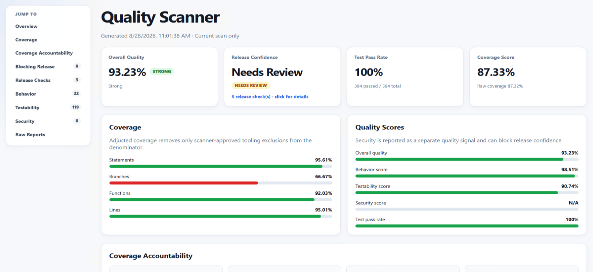

# Quality Scanner

`quality-scanner` consolidates behavioral scanning, testability analysis, coverage-accountability analysis, security checks, and project quality reporting into one pipeline.



## Understanding the dashboard

The four headline metrics answer different questions. Together, they provide a quick quality summary without allowing a strong average to hide a release-blocking problem.

### Overall Quality

**Overall Quality** is the weighted project score. By default, it combines Coverage Score (30%), Test Pass Rate (20%), testability (15%), behavior (15%), and security (20%). If a metric is unavailable, the available weights are normalized rather than treating the missing metric as zero. The accompanying health label translates the number into a quick status: Excellent (95+), Strong (90–94.99), Healthy (80–89.99), Needs Review (70–79.99), or At Risk (below 70).

### Release Confidence

**Release Confidence** is a risk classification—`High`, `Moderate`, `Needs Review`, `Blocked`, or `Unknown`—built from explicit release checks rather than another weighted average. Failing tests, fatal behavior findings, and fatal or error-level security findings can block a release. Security warnings, behavior errors, skipped tests, adjusted branch coverage below its threshold, or unclassified uncovered branches require review; an Overall Quality score below its threshold produces Moderate confidence.

This separate signal is valuable because averages can conceal critical failures. A high Overall Quality score should not make a release look safe when tests are failing or a serious security boundary is missing. Release Confidence surfaces the most severe active check and provides the reasons behind it, making it the more actionable go/no-go indicator.

### Test Pass Rate

**Test Pass Rate** is `passed / (passed + failed) × 100`. Skipped and todo tests are reported, but they are not counted as executed tests in this percentage. The score is `N/A` when no usable test result artifact or no executed tests are available.

### Coverage Score

**Coverage Score** is the average of the scanner's adjusted statement, branch, function, and line coverage percentages. It intentionally differs from the raw Istanbul coverage shown beneath it. Raw coverage describes exactly what the test suite reported; adjusted coverage removes skipped units from the relevant denominator and, for branches, also removes only verified scanner-approved tooling exclusions. Approved branch adjustments are capped at Istanbul's uncovered branch count, while fixable and unclassified uncovered branches remain in the denominator.

This distinction is valuable because generated or tooling-only branches can lower raw coverage without representing behavior that should be tested. The Coverage Score makes those narrowly approved exceptions accountable while preserving real gaps, so teams get a more useful quality signal without silently inflating coverage. The raw value remains visible for transparency and comparison with the test runner.

## Why this structure

The scanner has separate concerns but one engine:

- **behavior**: team engineering practices and project-specific patterns
- **testability**: source patterns that create difficult/noisy coverage branches
- **coverage accountability**: correlates Istanbul uncovered-branch markers with scanner findings and explicit approved exclusions
- **security**: frontend injection, storage, messaging, and transport checks plus Express endpoint security boundaries
- **quality**: combines adjusted coverage, test pass rate, testability, behavior, and security into one project score/report

A concern is not a separate scanner implementation. Rules share the same file discovery, ignore model, scoring, reporting, and CLI.

## Run

From this package (or after install):

```bash
npx quality-scanner
```

Specific gate:

```bash
npx quality-scanner --concern behavior
npx quality-scanner --concern testability
npx quality-scanner --concern coverage
npx quality-scanner --concern security
```

List rules:

```bash
npx quality-scanner --list-rules
```

Run without a non-zero quality gate exit code:

```bash
npx quality-scanner --no-fail
```

Emit a CI-friendly dashboard payload as JSON into a directory:

```bash
npx quality-scanner -ci ./quality-scanner-report
```

You can also point the scanner at an existing coverage artifact directory or file without rerunning test collection. Both Istanbul `coverage-summary.json` and `coverage-final.json` files are supported:

```bash
npx quality-scanner -ci ./quality-scanner-report -coverage-target="./coverage"
```

When an explicit coverage target is used and `reports/test-results.json` is not available, coverage and static scan scores are still reported while the test pass rate is shown as `N/A`.

Vitest's JSON reporter output at `reports/vitest-results.json` is also discovered automatically. In a split CI pipeline, preserve both `coverage/` and `reports/vitest-results.json` from the test aggregation job so the quality scan can reuse coverage and test pass/fail counts without rerunning tests.

This writes `quality-scanner-report.json` containing the same per-concern dashboard payload the HTML report would expose (`quality`, `behavior`, `testability`, and `security` sections plus their summaries). CI mode suppresses the live test/coverage progress display and emits one final, timestamp-friendly terminal report with quality and coverage bars plus folder/file scan scores. It also emits a GitLab-friendly console pass/fail line and exits with a non-zero code only when the computed `releaseConfidence` is `Blocked`.

CI score bars are green at 80% or higher, yellow from 50% through 79.99%, red below 50%, and gray when a score is unavailable. Set `NO_COLOR=1` to disable ANSI colors.

The final CI readout also colors release confidence, health, test outcomes, finding counts, coverage-marker counts, release checks, and the GitLab `PASS`/`FAIL` status according to their severity.

Test and coverage artifacts are reused automatically when both are valid and were updated within the previous 24 hours. The scanner searches all configured `testResultsPaths` and `coverageSummaryPaths`, so artifacts remain discoverable even when a package update changes the preferred output location.

Freshness alone only proves an artifact is recent, not that it reflects the full test suite - e.g. someone manually running `vitest run one.test.js --coverage` produces a coverage-summary.json that is perfectly "fresh" but only accounts for one file, which would otherwise cause the scanner to silently treat every other file as untested. To guard against this, reused (and freshly loaded) coverage/test-result artifacts are also checked for **completeness**: the scanner compares the files actually reported in the coverage summary, and the test files reflected in the normalized test-results artifact (when the runner reports per-suite data), against every testable file discovered under `scanRoots`. If either falls below the configured ratio, the artifact pair is rejected - reuse falls back to regenerating a full run, and an explicit final load fails loudly instead of producing a misleadingly low quality score.

Configure the thresholds (or disable the check) in your config:

```js
module.exports = {
  completeness: {
    enabled: true,
    minCoverageFileRatio: 0.9, // share of testable files that must appear in coverage
    minTestFileRatio: 0.9,     // share of discovered test files the run must have executed
  },
};
```

Passing an explicit `-coverage-target` opts out of the coverage completeness check, since that flag is an intentional, narrow scope rather than a stand-in for the full suite.

To change the rolling freshness window:

```js
module.exports = {
  freshness: {
    maxAgeHours: 24,
  },
};
```

Force a new test and coverage run even when recent artifacts exist:

```bash
npx quality-scanner --force-tests
```

The older `--reuse-artifacts` option remains accepted for compatibility, but reuse is now the default behavior.

## Recommended package.json scripts

```json
{
  "scripts": {
    "quality:scan": "quality-scanner",
    "quality:scan:behavior": "quality-scanner --concern behavior",
    "quality:scan:testability": "quality-scanner --concern testability",
    "quality:scan:security": "quality-scanner --concern security"
  }
}
```

For a full quality score, the scanner can collect tests and Istanbul coverage itself via a detected runner (Vitest, Jest, Mocha+nyc, AVA+nyc, or a custom adapter).

## Project configuration

Copy [`quality-scanner.config.example.cjs`](quality-scanner.config.example.cjs) to the repository root as:

```text
quality-scanner.config.cjs
```

The example file documents:

- `testablePathPrefixes` for narrowing coverage targets
- `behaviorRules` for local engineering conventions
- `pathRules` for naming and required/forbidden filesystem paths
- `organizationRules` for test placement and shared symbol organization
- security `publicEndpoints` **replace** vs `publicEndpointsExtra` **append** (and the same Extra pattern for middleware patterns)

The most important extension point is `behaviorRules`:

```js
module.exports = {
  behaviorRules: [
    {
      id: "no-direct-window-location",
      category: "architecture",
      severity: "warning",
      penalty: 8,
      description:
        "Navigation should go through the project navigation boundary.",
      suggestion: "Use the project navigation helper.",
      pattern: /window\.location\s*=/,
    },
  ],
};
```

That gives each adopting team a way to encode local engineering knowledge without modifying the scanner itself.

### Custom path and naming rules

Projects can also define `pathRules` for naming conventions and forbidden
file or directory path patterns. These rules match normalized paths relative
to the project root, including both files and directories under `scanRoots`.
They do not inspect file contents.

```js
module.exports = {
  pathRules: [
    {
      id: 'no-pascal-case-source-paths',
      category: 'naming',
      severity: 'error',
      penalty: 15,
      description: 'Source paths must use lowercase kebab-case.',
      suggestion: 'Rename the file or directory using lowercase kebab-case.',
      pathPattern: /(?:^|[\\/])[^\\/]*[A-Z][^\\/]*(?:$|\.[cm]?[jt]sx?$)/,
    },
  ],
};
```

Each path rule requires a unique `id` and either a regular-expression
`pathPattern` or an exact project-relative `path`. It may also define `mode`,
`category`, `severity`, `penalty`,
`description`, and `suggestion`; defaults are `naming`, `warning`, and `5`.
Matching paths are reported under the `structure` concern and in
`structure.json` and the CI dashboard JSON. They are not included in the
weighted Overall Quality score unless a project explicitly assigns a
`weights.structure` value. Error and fatal structure findings block release
confidence.

Rules default to `mode: 'forbidden'`, so a matching path produces a finding.
Use `mode: 'required'` with an exact project-relative `path` or a
`pathPattern` when at least one matching file or directory must exist:

```js
module.exports = {
  pathRules: [
    {
      id: 'requires-domain-directory',
      mode: 'required',
      path: 'src/domain',
      category: 'structure',
      severity: 'error',
      penalty: 20,
      description: 'The domain directory must exist.',
      suggestion: 'Create src/domain and keep domain code there.',
    },
    {
      id: 'forbid-legacy-directory',
      mode: 'forbidden',
      path: 'src/legacy',
      description: 'Legacy code must not be present.',
      suggestion: 'Migrate or remove the legacy directory.',
    },
  ],
};
```

Path rules include directories, even empty directories. Exact `path` rules
are checked against the project filesystem; pattern rules match discovered
paths under `scanRoots`. Missing required paths are reported as structure
findings with the expected path.

Run only these checks with:

```bash
npx quality-scanner --concern structure
```

### Organization rules

Use `organizationRules` for relationships between source files, tests, and
static module symbols. These rules analyze only static ES module syntax:
`import`, `export`, and named/default import relationships. They do not use
`require()`, `module.exports`, or dynamic `import()`.

Test-target conventions use a target path regex and a replacement template:

```js
{
  id: 'component-test-convention',
  type: 'test-target',
  targetPattern:
    /^(?<directory>src\/components\/(?<name>[^/]+))\/\k<name>\.(?<ext>tsx?)$/,
  testPathTemplate: '$<directory>/__test__/$<name>.test.$<ext>',
  requireImport: true,
  severity: 'error',
  penalty: 20,
  description: 'Component tests must be colocated under __test__.',
  suggestion: 'Use <name>.test.<ext> under the target __test__ directory.',
}
```

Shared exported symbols can be restricted to approved filenames. The rule
counts static ES module consumers and only reports symbols used by at least
`minimumConsumers` files:

```js
{
  id: 'shared-constants-location',
  type: 'shared-symbol-location',
  symbolType: 'constant',
  symbolPattern: /^[A-Z][A-Z0-9]*(?:_[A-Z0-9]+)+$/,
  allowedFilePattern: /(?:^|[./])[^/]*constants[^/]*\.[cm]?[jt]sx?$/,
  minimumConsumers: 2,
  description: 'Shared constants must be exported from a constants file.',
  suggestion: 'Move the shared constant to a constants-named module.',
}
```

Use `symbolType: 'function'` and an allowed filename containing `utils` for
shared utility functions:

```js
{
  id: 'shared-functions-location',
  type: 'shared-symbol-location',
  symbolType: 'function',
  symbolPattern: /^[a-z][A-Za-z0-9]+$/,
  allowedFilePattern: /(?:^|[./])[^/]*utils[^/]*\.[cm]?[jt]sx?$/,
  minimumConsumers: 2,
  description: 'Shared functions must be exported from a utils file.',
  suggestion: 'Move the shared function to a utils-named module.',
}
```

Named exports and named/default function exports are supported. Organization
findings are reported under the `structure` concern.

## Ignore comments

Prefer the modern directive form (targets + reason required):

```ts
// quality-scanner-ignore-next-line no-direct-window-location -- intentional for demo
window.location = target;
```

Multiple targets:

```ts
// quality-scanner-ignore-next-line rule-one,rule-two -- Reviewed exception.
```

The `-- reason` suffix is required. A modern directive containing only a rule name is ignored and does not suppress the finding. When a matching finding remains, its description explains that the comment is missing a reason and shows how to add one. This also applies to a `--` suffix with an empty reason. Place the comment immediately above the reported line; for a multiline Express route, this is the line where the route call starts:

```ts
// quality-scanner-ignore-next-line endpoint-missing-authentication -- Reviewed logout exception.
apiRouter.post("/auth/logout", auth.logoutHandler(), (_req, res) =>
  res.json({
    message: "Logged out",
  }),
);
```

Replace the example reason with the justification for your reviewed exception.

Legacy forms still work:

```ts
// quality ignore next
someCode();

// behavior ignore next no-direct-window-location
window.location = target;
```

Use ignores sparingly. They remain visible in source review instead of silently modifying global coverage settings.

## Coverage model

The scanner deliberately exposes three different uncovered-branch classifications:

1. **Approved exclusions** — actual Istanbul branch markers matching a configured, verified tooling-only exclusion rule. These are removed from adjusted coverage.
2. **Fixable candidates** — actual Istanbul branch markers that line up with testability findings such as optional chaining, optional callbacks, ternaries, fallbacks, and default props. They remain in the denominator.
3. **Unclassified markers** — uncovered branch markers that are neither approved exclusions nor known fixable candidates. They remain in the denominator and require review.

This prevents the quality score from improving merely because the scanner failed to recognize the cause of an uncovered branch.

## Reports

Generated under:

```text
reports/quality-scanner/
  behavior.json
  testability.json
  security.json
  quality.json
  index.html
```

The HTML dashboard embeds source context for every finding. Clicking a file/line link jumps to the scanned source excerpt with the finding line highlighted.

Unless `--no-open` is passed, the scanner starts a local Node static server on an automatically assigned port and opens the dashboard URL. Set a fixed port for a run with:

```sh
npx quality-scanner --port 8080
```

`--port=8080` is also supported. To save the port for a project, set `dashboard.port` in `quality-scanner.config.cjs`:

```js
module.exports = {
  dashboard: {
    port: 8080,
  },
};
```

The command-line option overrides the config setting. Ports must be integers from `0` to `65535`; `0` (the default) selects an available port automatically. The dashboard stays bound to `127.0.0.1`. If a fixed port is already in use, startup fails instead of switching ports. CI mode and `--no-open` do not start the dashboard server.

### Dashboard theme preference

The dashboard defaults to dark mode. Use the Dark mode / Light mode toggle in the top-right corner to change it. The live dashboard saves the selection in the scanned project at:

```text
.quality-scanner/quality-scanner-preferences.json
```

The next dashboard run reads this file before rendering, so the saved theme is selected automatically. Because the file belongs to the scanned project rather than the installed package under `node_modules`, updating `quality-scanner` does not reset it. Add `.quality-scanner/quality-scanner-preferences.json` to the project's `.gitignore` when the theme should remain a per-user preference.

The location and first-run theme can be configured if needed:

```js
module.exports = {
  dashboard: {
    defaultTheme: 'dark',
    preferenceFile: '.quality-scanner/quality-scanner-preferences.json',
  },
};
```

Saving requires the local dashboard server started by the normal `npx quality-scanner` flow. A standalone `file://` copy still uses the theme embedded when the report was generated, but cannot write the preference file directly.

The scanner intentionally writes only the current scan. Historical/trend storage is outside the scope of this tool and can be layered on later.

## Frontend security scanning

The security concern also scans browser JavaScript, TypeScript, JSX, and TSX for high-signal client-side risks:

- `unsafe-dom-html-injection` — direct HTML sinks such as `innerHTML`, `document.write`, `insertAdjacentHTML`, and React's `dangerouslySetInnerHTML`
- `dynamic-code-execution` — `eval`, `new Function`, or string-based timers
- `sensitive-browser-storage` — credential-like values written to `localStorage` or `sessionStorage`
- `wildcard-postmessage-origin` — cross-window messages sent with a `*` target origin
- `insecure-frontend-transport` — non-local browser requests using HTTP or unencrypted WebSockets
- `javascript-url` — executable `javascript:` navigation URLs

Known `DOMPurify.sanitize(...)` and `sanitizeHtml(...)` calls are accepted for HTML sinks, and localhost/loopback HTTP and WebSocket URLs are accepted for local development. Projects can replace or append to those patterns:

```js
module.exports = {
  security: {
    trustedHtmlSanitizerPatternsExtra: [/\bprojectSanitizeHtml\s*\(/],
    insecureTransportAllowedPatternsExtra: [
      /\bhttp:\/\/dev-api\.internal(?::\d+)?\//i,
    ],
  },
};
```

These checks identify risky browser APIs and trust boundaries; they do not perform runtime taint tracking or prove that a value is attacker-controlled. Use a documented `quality-scanner-ignore-next-line` directive for a reviewed exception. Set `security.frontendEnabled` to `false` only when frontend security is intentionally enforced elsewhere.

When frontend security is enabled and source files are scanned successfully, a clean scan reports a Security Score of 100. `N/A` is reserved for cases where security scanning is disabled or no source files were available to scan.

## Endpoint security scanning

For JavaScript/TypeScript Express backends, the scanner includes a `security` concern that inventories static endpoint declarations and looks for missing or incomplete security boundaries.

```bash
npx quality-scanner --concern security
```

The scanner recognizes common forms including:

```ts
app.get("/accounts", requireAuth, handler);
router.post("/applications", requireAuth, handler);
router.use(requireAuth);
router.route("/accounts/:id").get(requireAuth, handler);
app.use("/api", requireAuth, importedRouter);
app.use("/api", requireAuth, require("./routes"));
```

It currently reports:

- `endpoint-missing-authentication` — endpoint has no recognized auth boundary and is not explicitly public
- `object-endpoint-authorization-review` — authenticated `:id`-style resource endpoint where object/function authorization could not be proven
- `authentication-endpoint-missing-rate-limit` — login/token/password-style endpoint without a recognized limiter

Security errors are release-blocking independently of the weighted quality score.

### Explicit public endpoints

The default public allowlist contains only common health/readiness probes. Other anonymous endpoints should be intentionally declared:

```js
module.exports = {
  security: {
    // Append to defaults:
    publicEndpointsExtra: [
      {
        method: "POST",
        pathPattern: /^\/login$/,
        reason: "Authentication entry point",
      },
    ],
    // Or replace the entire allowlist:
    // publicEndpoints: [ ... ],
  },
};
```

Declaring an authentication endpoint public does not disable the rate-limit check.

### Project-specific security middleware

```js
module.exports = {
  security: {
    authMiddlewarePatternsExtra: [/\brequireSession\b/],
    authorizationMiddlewarePatternsExtra: [/\brequireAccountAccess\b/],
    rateLimitMiddlewarePatternsExtra: [/\bsignInRateLimiter\b/],
  },
};
```

Patterns are added to the built-in defaults unless you set the non-`Extra` key to replace them.

### What the scanner can and cannot prove

This is static configuration analysis, not a penetration test. It can prove that a recognizable middleware boundary exists in common Express route arrangements, including imported routers mounted behind middleware. It cannot prove that the middleware itself is correct, that handler-level authorization is correct, or that infrastructure outside the source tree is enforcing access control.

## Scanner tests

```bash
npm test
```

## Package layout

Published files include `index.cjs`, `config.cjs`, `lib/`, `rules/`, and this README. Requires Node.js 18+.
